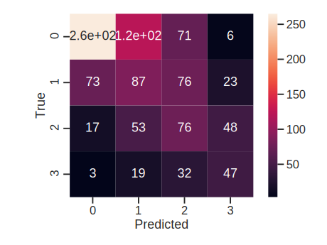

# Reactify

General-purpose reactivity detection using proton NMR spectra. See also [Rx1st], _"Reactivity first exploration of chemical space"_ making use of Reactify's reactivity assignments. 

## Installation

You can install the _Reactify_ package using `pip`:

`pip install git+https://github.com/croningp/Reactify`

For development, we recommend cloning the repository and installing it in development mode instead.

```shell
git clone https://github.com/croningp/Reactify
pip install -e .
```

### Installing dependencies using conda
Optionally, you can use conda to install dependencies first
```shell
conda create -n Reactify --file Reactify/conda_list.txt
conda activate Reactify
``` 

## Getting started

### Training the model

You can train the _Reactify_ model using the dataset from the original publication. To do
so, [download] the manuscript dataset and extract `reactify_data.tar.xz` to the _Reactify_ installation
folder:

```shell
cd <installation directory or directory where you cloned Reactify>
wget https://zenodo.org/record/4670997/files/reactify_data.tar.xz?download=1
tar xvf reactify_data.tar.xz
```

Alternatively, manually download the dataset and place it in the installation folder.

You can now launch the training script from anywhere:

```shell
# To see the script's full list of command line parameters
python -m Reactify.training -h

# e.g.
python -m Reactify.training --leave_out 1018 --no-plot models/reactify_model
```

In addition to the trained model, this script also plots the confusion matrix as well as (optionally) a plot showing the reactivity assignment for each example in the test dataset.



### Inference
For quick assigment of reactivity, the script in `inference.py` gives a command-line interface for running inference:

```shell
python -m Reactify.inference <path to trained model> <path to reaction spectrum> <path to reactant 1 spectrum> <path to reactant 2 spectrum> ...
```

The manuscript dataset inlcludes a pre-trained model (under `data/FinderX-pretrained`) that you can use as reference. This model has been trained on the simple chemical (non-photochemical) space only.

[download]: https://zenodo.org/record/4670997
[Rx1st]: https://github.com/croningp/Rx1st